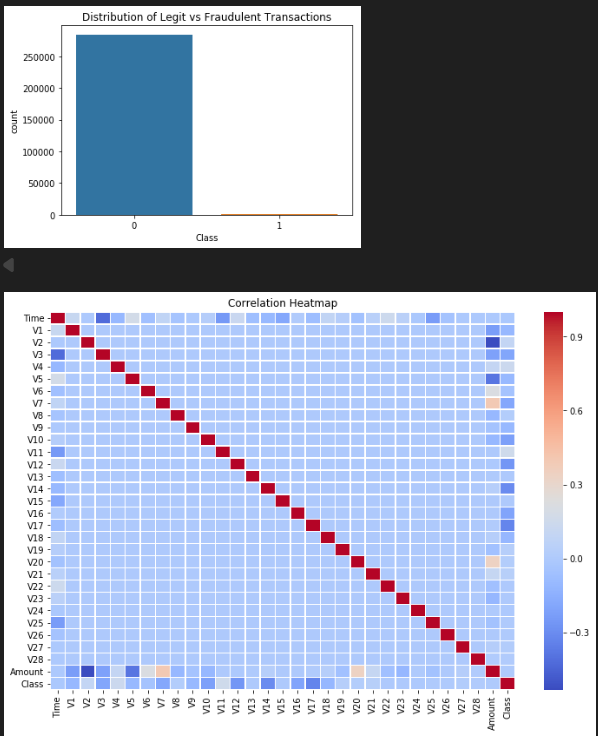
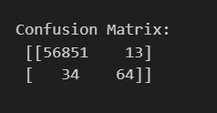

# Credit Card Fraud Detection

## Overview

A machine learning project to detect fraudulent credit card transactions using classification techniques.

---

## Objective

Build a predictive model that identifies fraudulent transactions while handling highly imbalanced data.

---

## Dataset

* Source: Credit Card Fraud Dataset
* Contains anonymized transaction features (`V1-V28`)
* Includes:

  * `Time`
  * `Amount`
  * `Class` (0 = Legit, 1 = Fraud)

---

## Project Workflow

1. Data Loading
2. Exploratory Data Analysis
3. Data Preprocessing
4. Feature Scaling
5. Model Training
6. Evaluation

---

## Tech Stack

* Python
* Pandas
* NumPy
* Matplotlib / Seaborn
* Scikit-Learn
* Jupyter Notebook

---

## Results

### Fraud Distribution

### Confusion Matrix

---

## Future Improvements

* Try XGBoost / Random Forest
* Hyperparameter Tuning
* Deploy as Web App / API

---

## Author

Rahul Chawla
